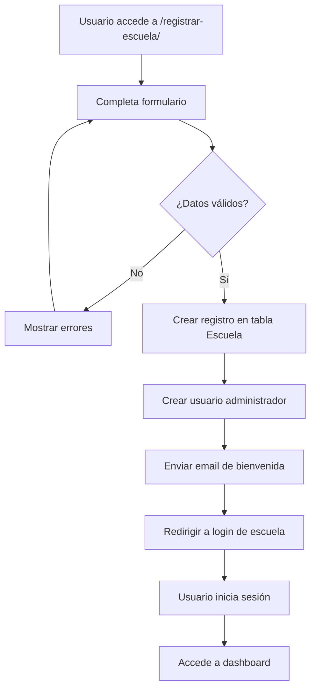

# 🏫 Sistema de Registro de Escuelas - Multi-Tenant

## ✅ ¿Qué se ha Implementado?

Sistema completo de registro público para que **nuevas escuelas/colegios** se registren y tengan su propio espacio aislado en el sistema.

---

## 🌐 URL de Acceso

### Sitio Principal (Público)
```
http://localhost:8000/registrar-escuela/
http://127.0.0.1:8000/registrar-escuela/
```

### Sitios de Escuelas Registradas
```
http://nombreescuela.localhost:8000/
http://otraescuela.localhost:8000/
```

---

## 📁 Archivos Creados/Modificados

### ✅ Template
- **Archivo:** `escuelaweb/templates/public/registro_escuela.html`
- **Descripción:** Formulario completo y profesional para registro de escuelas
- **Características:**
  - Diseño moderno con degradados
  - Validación en frontend (JavaScript)
  - Preview del subdominio en tiempo real
  - Secciones organizadas (Institución, Plan, Administrador)
  - Responsive y compatible con todos los navegadores

### ✅ Vista
- **Archivo:** `escuelaweb/views.py` (función `registrar_escuela()`)
- **Funcionalidad:**
  - Validación de datos (subdominio único, email único, contraseñas)
  - Creación automática de escuela en modelo `Escuela`
  - Creación de usuario administrador con permisos
  - Envío de email de bienvenida (HTML)
  - Redirección automática al login de la nueva escuela

### ✅ URL
- **Archivo:** `escuelaweb/urls.py`
- **Ruta:** `path('registrar-escuela/', views.registrar_escuela, name='registrar_escuela')`

---

## 📝 Datos que se Capturan

### 🏢 Información de la Institución
| Campo | Requerido | Descripción |
|-------|-----------|-------------|
| `nombre_escuela` | ✅ | Nombre completo oficial |
| `nombre_corto` | ✅ | Subdominio (solo letras minúsculas, números, guiones) |
| `email_escuela` | ✅ | Email institucional |
| `telefono_escuela` | ✅ | Teléfono de contacto |
| `rnc` | ❌ | Registro Nacional del Contribuyente |
| `direccion_escuela` | ✅ | Dirección física completa |

### 👑 Plan de Suscripción
| Plan | Usuarios | Precio | Duración Prueba |
|------|----------|--------|-----------------|
| Gratis | 50 | $0 | 30 días |
| Básico | 200 | $29/mes | - |
| Estándar | 500 | $59/mes | - |
| Premium | Ilimitados | $99/mes | - |

### 👤 Usuario Administrador
| Campo | Requerido | Descripción |
|-------|-----------|-------------|
| `admin_nombre` | ✅ | Nombre completo |
| `admin_email` | ✅ | Email (será username) |
| `admin_password` | ✅ | Contraseña (mínimo 8 caracteres) |
| `admin_password_confirm` | ✅ | Confirmación de contraseña |

---

## 🔍 Validaciones Implementadas

### Backend (views.py)
```python
# 1. Contraseñas coinciden
if admin_password != admin_password_confirm:
    messages.error(request, 'Las contraseñas no coinciden.')

# 2. Nombre corto válido (formato subdominio)
if not re.match(r'^[a-z0-9-]+$', nombre_corto):
    messages.error(request, 'Solo letras minúsculas, números y guiones.')

# 3. Subdominio único
if Escuela.objects.filter(nombre_corto=nombre_corto).exists():
    messages.error(request, 'El subdominio ya está en uso.')

# 4. Email administrador único
if CustomUser.objects.filter(email=admin_email).exists():
    messages.error(request, 'Ya existe una cuenta con este email.')
```

### Frontend (JavaScript)
```javascript
// Preview de subdominio en tiempo real
document.getElementById('nombre_corto').addEventListener('input', function(e) {
    let valor = e.target.value.toLowerCase()
        .replace(/[^a-z0-9-]/g, '')
        .replace(/\s+/g, '-');
    document.getElementById('previewUrl').textContent = valor + '.escuelaenlinea.com';
});

// Validar contraseñas coinciden antes de enviar
document.getElementById('formRegistro').addEventListener('submit', function(e) {
    if (password !== confirm) {
        e.preventDefault();
        alert('Las contraseñas no coinciden.');
    }
});
```

---

## ✉️ Email de Bienvenida

Se envía automáticamente un email HTML con:
- ✅ Datos de acceso (URL, email, plan)
- ✅ Link directo al login
- ✅ Próximos pasos
- ✅ Información de soporte

**Ejemplo de URL generada:**
```
http://santodomingo.localhost:8000/login/
```

---

## 🎯 Flujo de Registro



---

## 🚀 Cómo Probar el Sistema

### Paso 1: Acceder al Formulario
```
http://localhost:8000/registrar-escuela/
```

### Paso 2: Completar Datos de Ejemplo
```
📋 INSTITUCIÓN:
- Nombre: Colegio Santo Domingo
- Nombre Corto: santodomingo
- Email: info@santodomingo.edu.do
- Teléfono: (809) 555-0000
- Dirección: Av. Principal #123, Santo Domingo

👑 PLAN:
- Plan: Gratis (30 días)
- Usuarios estimados: 50

👤 ADMINISTRADOR:
- Nombre: Juan Pérez
- Email: juan.perez@gmail.com
- Contraseña: MiPassword123
- Confirmar: MiPassword123

✅ Aceptar términos
```

### Paso 3: Configurar Hosts (IMPORTANTE)
Para probar con subdominios en local, agregar a `C:\Windows\System32\drivers\etc\hosts`:
```
127.0.0.1 santodomingo.localhost
127.0.0.1 prueba.localhost
127.0.0.1 colegio1.localhost
```

### Paso 4: Enviar Formulario
Al enviar, se crea:
1. ✅ Escuela en base de datos
2. ✅ Usuario administrador
3. ✅ Email de bienvenida
4. ✅ Redirección automática

### Paso 5: Iniciar Sesión
```
URL: http://santodomingo.localhost:8000/login/
Email: juan.perez@gmail.com
Contraseña: MiPassword123
```

---

## 📊 Datos Almacenados

### Tabla: `escuelaweb_escuela`
```sql
INSERT INTO escuelaweb_escuela (
    nombre, nombre_corto, email_contacto, telefono,
    rnc, direccion, plan, max_usuarios, activo,
    fecha_suscripcion, fecha_creacion
) VALUES (
    'Colegio Santo Domingo',
    'santodomingo',
    'info@santodomingo.edu.do',
    '(809) 555-0000',
    '',
    'Av. Principal #123',
    'gratis',
    50,
    TRUE,
    NOW(),
    NOW()
);
```

### Tabla: `escuelaweb_customuser`
```sql
INSERT INTO escuelaweb_customuser (
    email, password, first_name, last_name,
    rol, is_active, is_staff
) VALUES (
    'juan.perez@gmail.com',
    'pbkdf2_sha256$...',  -- Hash de contraseña
    'Juan',
    'Pérez',
    'Administrador',
    TRUE,
    TRUE
);
```

---

## 🔐 Seguridad Implementada

| Característica | Implementación |
|----------------|----------------|
| **CSRF Protection** | `` en formulario |
| **Password Hashing** | `create_user()` usa hasher de Django |
| **Validación de Email** | `type="email"` + backend validation |
| **Subdominio Seguro** | Regex `^[a-z0-9-]+$` |
| **Duplicados** | Verificación de unicidad en BD |
| **Rate Limiting** | Ya configurado (5000 req/min) |

---

## 🎨 Características del Diseño

- ✅ Degradado moderno (púrpura)
- ✅ Tarjetas con sombras
- ✅ Iconos Font Awesome
- ✅ Preview de subdominio en tiempo real
- ✅ Tooltips informativos
- ✅ Responsive (móvil, tablet, desktop)
- ✅ Validación visual
- ✅ Animaciones suaves

---

## 🛠️ Personalizaciones Posibles

### Cambiar Dominio Base
En el template `registro_escuela.html` línea 212:
```javascript
document.getElementById('previewUrl').textContent = valor + '.escuelaenlinea.com';
```

Cambiar por tu dominio real:
```javascript
document.getElementById('previewUrl').textContent = valor + '.tudominio.com';
```

### Agregar Más Planes
En el template, sección de select de planes (línea 161):
```html
<option value="enterprise">🏢 Enterprise - $299/mes</option>
```

### Personalizar Email
En `views.py`, función `registrar_escuela`, variable `html_message` (línea ~107)

---

## 📱 Próximos Pasos Sugeridos

### 1. Agregar Campo `escuela` a Modelos
```python
# En models.py - CustomUser
escuela = models.ForeignKey(
    'Escuela',
    on_delete=models.PROTECT,
    related_name='usuarios',
    null=True,
    blank=True
)
```

### 2. Asignar Escuela en Registro
```python
# En views.py - registrar_escuela
admin_user = CustomUser.objects.create_user(
    # ... otros campos ...
    escuela=escuela  # Agregar esta línea
)
```

### 3. Panel de Administración de Escuelas
Crear vista para que superadmin pueda:
- Ver todas las escuelas registradas
- Editar/suspender/eliminar escuelas
- Ver estadísticas de uso

### 4. Sistema de Pagos
Integrar con pasarela de pagos para:
- Cobrar suscripciones mensuales
- Upgrade/downgrade de planes
- Facturación automática

### 5. Personalización por Escuela
- Logo
- Colores personalizados
- Dominio propio (CNAME)

---

## 🐛 Troubleshooting

### Error: "El subdominio ya está en uso"
**Solución:** Elige otro nombre corto único

### Error: "Ya existe una cuenta con este email"
**Solución:** Usa otro email para el administrador

### Error: Subdominio no funciona
**Solución:** 
1. Verificar archivo `hosts`
2. Reiniciar navegador
3. Limpiar caché DNS: `ipconfig /flushdns`

### Email no se envía
**Solución:** 
- Verificar configuración SMTP en `.env`
- Revisar logs: `logs/security.log`
- El sistema sigue funcionando sin email

---

## 📞 Soporte

Para dudas o problemas:
- **Documentación:** `PRUEBA_MULTITENANT_LOCAL.md`
- **Guía Completa:** `GUIA_MULTITENANT.md`
- **Logs:** `logs/security.log`

---

## 🎉 ¡Sistema Listo para Producción!

El sistema de registro está completo y funcional. Solo falta:
1. Agregar FK `escuela` a los modelos principales
2. Configurar dominio real en producción
3. Configurar pasarela de pagos (opcional)

**¡Felicidades! Ahora cualquier escuela puede registrarse automáticamente.** 🚀
